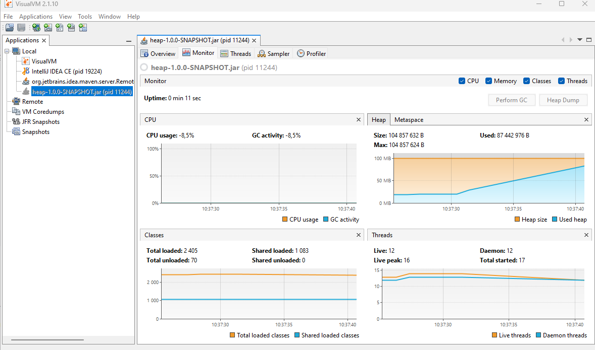
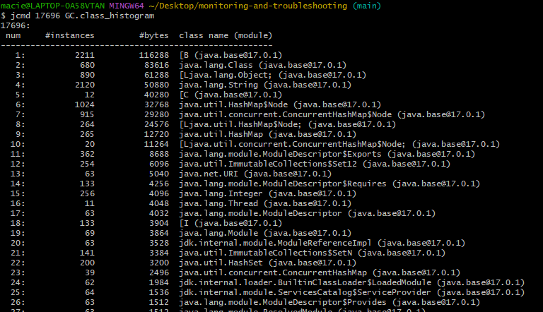
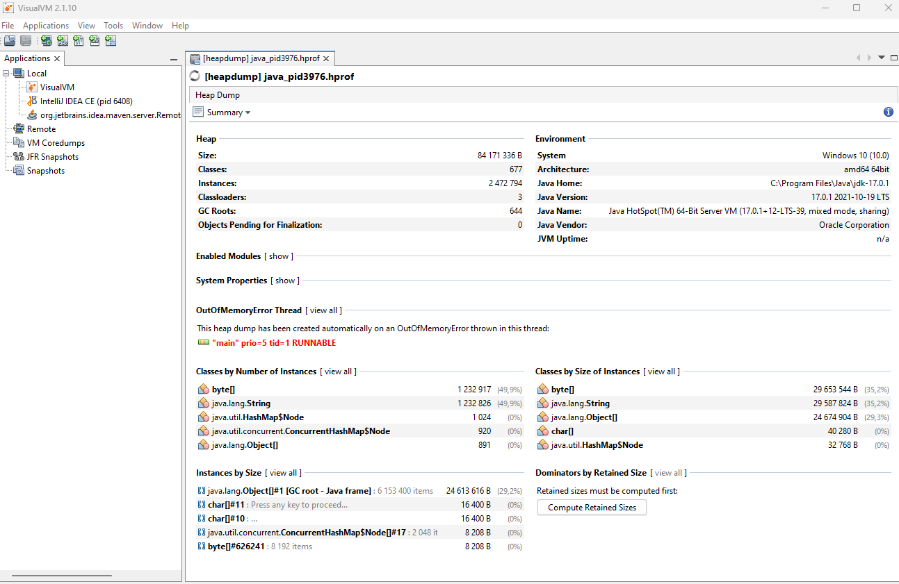
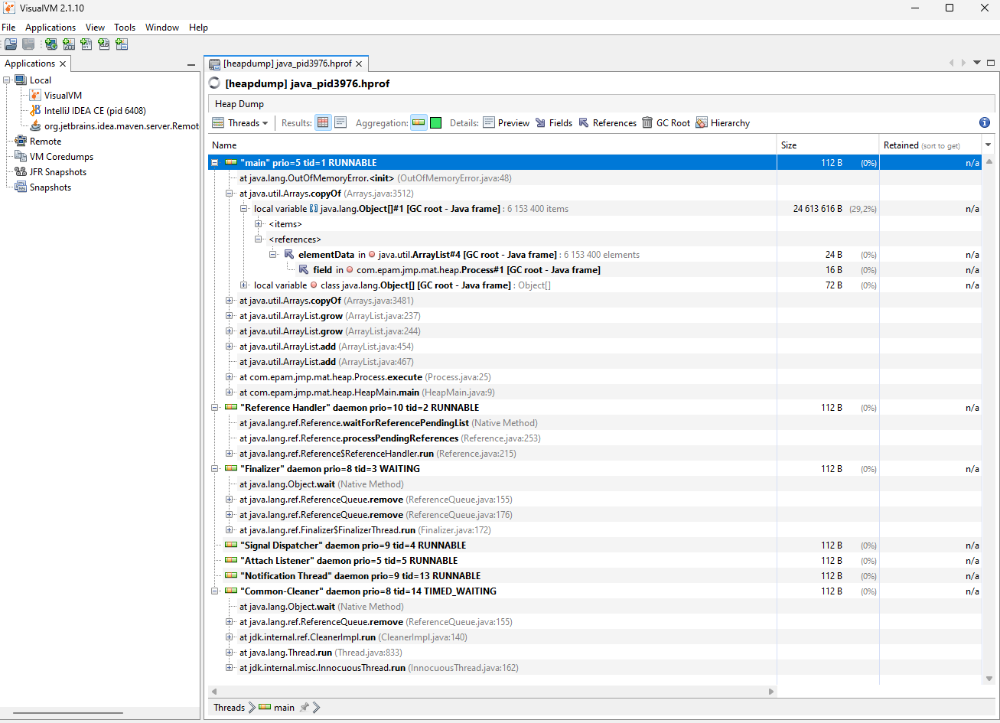
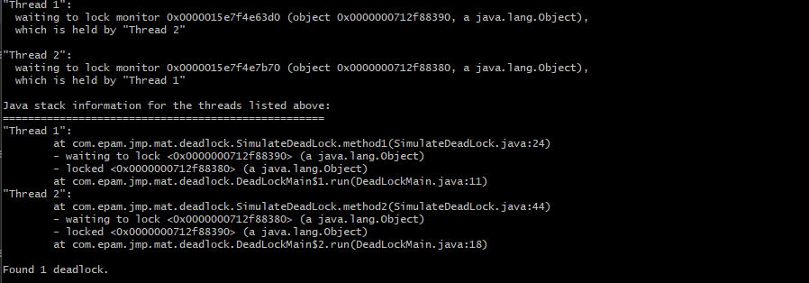

# Monitoring and troubleshooting

## QUIZ

### Which interface JDK tools use to connect to JVM locally?
JMX (Java Management Extensions) API - it is a technology that provides tools for managing and monitoring applications, system objects, devices, and service-oriented networks. Those resources are represented by objects called MBeans (Managed Beans).

JMX is designed to provide a simple and standardized way to manage resources at runtime in a Java environment. This API is widely used in enterprise systems for managing and monitoring application configurations and performance.

Key components of the JMX API include:

1. **MBeans**: These are Java objects that represent manageable resources, such as application configurations or system services. MBeans expose attributes and operations that can be accessed and invoked by a JMX-compliant management console.

2. **MBean Server**: This is a container for MBeans. It acts as a registry for all MBeans in the system and provides management and monitoring capabilities through those MBeans.

3. **JMX Agent**: Consisting of the MBean server and a set of services for handling MBeans, this agent can communicate with remote management applications.

4. **Notifications**: This feature allows MBeans to notify listeners of specific events (like state changes or specific conditions being met). For example, an MBean can notify other components if an error occurs or a threshold is surpassed.

5. **JMX Connectors and Adapters**: These enable the JMX agent to be accessible remotely using various protocols. Adapters can translate JMX operations and notifications to a form compatible with other protocols like HTTP or SNMP.

The JMX API is flexible and can be used in literally any environment or application running on the Java platform. It provides the tools you need to build your own management and monitoring system, or to integrate with existing management solutions.


### What is difference between profiling and traceability?

#### Profiling
Profiling refers to a form of performance analysis that involves collecting data about a program’s memory use, CPU time, and other resource utilizations during its execution. The primary goal of profiling is to identify performance bottlenecks and areas for optimization within the application’s code. Profilers provide detailed statistics and metrics on various aspects such as execution time of methods, frequency of method calls, and memory allocation, which help developers optimize the application effectively.

Example tools:
1. **VisualVM:** Bundled with the JDK, VisualVM provides CPU, memory, and GC profiling, apart from basic monitoring capabilities like heap dump and thread analysis.
2. **YourKit Java Profiler:** A commercial profiling tool known for its robust CPU and memory profiling features. It provides powerful analysis capabilities to help detect memory leaks, optimize memory usage, and analyze performance issues.
3. **JProfiler:** Another commercial profiler that offers a wide range of profiling features including memory usage, CPU profiling, and thread profiling.
4. **Java Mission Control (JMC)** and **Java Flight Recorder (JFR):** Java Mission Control is a set of tools for managing, monitoring, profiling, and troubleshooting Java applications. Java Flight Recorder collects detailed runtime information so that it can be analyzed by JMC.

#### Traceability
Traceability, refers to the ability to trace the execution path of an application at runtime. This often involves generating logs, execution traces, or detailed reports of the steps the application goes through, including function calls, state changes, and interactions with external systems. Traceability is crucial for debugging, understanding application behavior, auditing purposes, and ensuring that the application adheres to expected flow and logic.

Example tools:
1. **Log4j:** Log4j is a popular logging framework provided by Apache and widely used in Java applications.
2. **Zipkin:** An open-source distributed tracing system that helps gather timing data needed to troubleshoot latency problems in service architectures.
3. **Jaeger:** Inspired by Dapper and OpenZipkin, Jaeger is another open-source, end-to-end distributed tracing system that monitors and troubleshoots transactions in complex distributed systems.
4. **Spring Cloud Sleuth:** Integrates with Spring Boot applications to provide tracing via logs and supports integration with Zipkin.

#### Combined tools
Some tools provide both profiling and tracing capabilities:

1. **New Relic:** Offers performance monitoring including real-user, application, and infrastructure profiling alongside distributed tracing.
2. **Dynatrace:** Provides extensive application performance monitoring features that cover profiling and deep dive diagnostics across application traces.
3. **Datadog:** Though primarily a monitoring service, it also offers profiling and APM capabilities with tracing and log management features.

#### Key Differences
1. **Purpose:** Profiling is used primarily for performance optimization and is focused on metrics related to how the software uses system resources. Traceability, on the other hand, is about providing visibility into the execution path and behavior of the application, helping developers and system administrators understand how the application processes data and handles operations.

2. **Data Collected:** Profiling gathers data related to resource consumption, such as CPU cycles, memory usage, and execution time. Traceability collects data related to the sequence of operations executed, such as function calls, parameter values, and the sequence of executed code blocks.

3. **Tools and Techniques:** Profiling typically uses specific profiling tools that attach to the running application to gather performance metrics. These tools might sample or instrument the code to capture the necessary data efficiently. Traceability might use logging frameworks, dedicated tracing tools like distributed tracing systems (e.g., Zipkin, Jaeger), or built-in support in languages and frameworks for capturing execution details.

4. **Use Case:** Profiling is often done during the testing phase to optimize the code before production or when performance issues arise in production. Traceability is used throughout the development lifecycle for debugging during development, and can also be important in production for monitoring and diagnosing runtime issues.

Understanding both profiling and traceability and how they complement each other allows teams to both optimize performance and maintain visibility into application behavior, which is essential for maintaining robust, efficient, and trustworthy systems.

### Links
1. Oracle - Java Monitoring and Management: https://docs.oracle.com/en/java/javase/21/management/overview-java-se-monitoring-and-management.html#GUID-EA3CFF69-F0D3-47AB-9AED-EF1CBF7F2B24
2. Oracle - General Java Troubleshooting: https://docs.oracle.com/en/java/javase/21/troubleshoot/general-java-troubleshooting.html
3. Oracle - Overview of Java SE Monitoring and Management: https://docs.oracle.com/javase/8/docs/technotes/guides/management/overview.html
4. Baeldung - Understanding Memory Leaks: https://www.baeldung.com/java-memory-leaks
5. Reflectoring - Creating and Analyzing Java Heap Dumps: https://reflectoring.io/create-analyze-heapdump/

## Environment specification


## OutOfMemory (OOM) error troubleshooting

### Get OOM error
```
java -jar -Xmx100m heap-1.0.0-SNAPSHOT.jar
```


### Use jvisualvm to observe OOM


### Get heap dump

#### Using -XX:+HeapDumpOnOutOfMemoryError option
```
java -jar -Xmx100m -XX:+HeapDumpOnOutOfMemoryError heap-1.0.0-SNAPSHOT.jar
```


#### [Optional] Using jcmd
```
jps -lvm
```

```
jcmd <pid> GC.heap_dump <filename>
```

```
jmap -dump:format=b,file=snapshot.hprof <pid>
```


### Get heap histogram

#### Using jcmd
```
jcmd <pid> GC.class_histogram
```


#### Using jmap
```
jmap -histo <pid> 
```


### Analyze heap dump

#### Using Java Visual VM





#### OQL

Execute OQL in jvisualvm:
```
select objs from java.lang.Object[] objs where objs.length > 100
```

```
select referrers(objs) from java.lang.Object[] objs where objs.length > 100
```

```
select referrers(arr) from java.util.ArrayList arr where arr.size > 100
```


Startup jhat (note: jhat was decommissioned in JDK 9)
```
jhat <head_dump.hprof>
```


Execute:
```
select [objs, objs.length] from [Ljava.lang.Object; objs where objs.length > 100
```


Execute:
```
select referrers(objs) from [Ljava.lang.Object; objs where objs.length > 100
```


Execute:
```
select referrers(arr) from java.util.ArrayList arr where arr.size > 100
```


## Deadlock troubleshooting

### Get deadlock
```
java -jar deadlock-1.0.0-SNAPSHOT.jar
```


### Get thread dump

#### jstack
```
jstack -l <pid>
```



#### kill -3
```
kill -3 <pid>
```
This doesn't wok on Windows:
```
$ kill -3 22136
bash: kill: (22136) - No such process
```

#### visual vm


#### Windows (Ctrl + Break)

#### jcmd
````
jcmd <pid> Thread.print
````


## Remote JVM profiling
For insecure remote connection use parameters:
```
-Dcom.sun.management.jmxremote
-Dcom.sun.management.jmxremote.port=7890
-Dcom.sun.management.jmxremote.authenticate=false
-Dcom.sun.management.jmxremote.ssl=false
```
```
java -jar -Dcom.sun.management.jmxremote -Dcom.sun.management.jmxremote.port=7890 -Dcom.sun.management.jmxremote.authenticate=false -Dcom.sun.management.jmxremote.ssl=false simple-1.0.0-SNAPSHOT.jar
```


